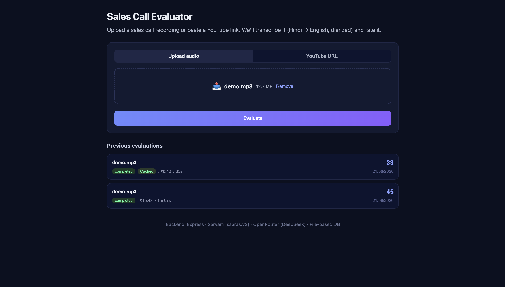
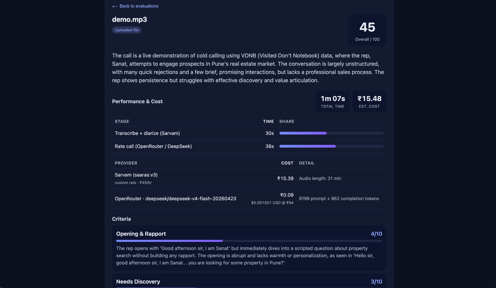

# Saleval — Sales Call Evaluator

**[sales-eval.onrender.com](https://sales-eval.onrender.com/)**

Upload a sales call recording. Saleval transcribes Hindi audio into English with speaker diarization, and scores the call across 5 sales-quality criteria using AI.

YouTube URL support is available in the dev environment only.

Built with Express, React + Vite, Sarvam AI (transcription), and OpenRouter (DeepSeek).

> **Access is by invite only.** Contact me to get access.

## How it works

```
Recording → mono 16 kHz mp3 → Sarvam saaras:v3 transcription + diarization → DeepSeek rating → results
```

1. Upload an audio file (MP3, WAV, M4A)
2. Audio is converted to mono 16 kHz mp3
3. Sarvam transcribes Hindi audio to English diarized text
4. DeepSeek (via OpenRouter) rates the call on 5 criteria
5. Results show overall score, per-criteria breakdown, strengths, improvements, and the full transcript

 

## Quick start

```bash
cp .env.example .env
# Edit .env — set SARVAM_API_KEY and OPENROUTER_API_KEY

npm install
npm run dev
```

Frontend at `http://localhost:5173`, backend at `http://localhost:4000`.

### Production (Render)

```bash
# Render build command
npm install && npm run build

# Render start command
npm start
```

Set env vars (`SARVAM_API_KEY`, `OPENROUTER_API_KEY`, etc.) in the Render dashboard — no `.env` file needed. The backend serves both the API and the built frontend on a single port.

## Requirements

- Node.js 18+
- npm 9+
- ~500 MB disk for Puppeteer Chromium (tests only)

## Tech stack

- **Backend**: Express, multer, ffmpeg-static, sarvamai, OpenRouter API, cookie-parser
- **Frontend**: React 18, Vite 8
- **DB**: File-based JSON (`backend/src/data/db.json`)
- **Tests**: Puppeteer

## Project structure

```
├── backend/          Express API server
│   └── src/
│       ├── server.js
│       ├── routes/   evaluate, history
│       └── services/ youtube, sarvam, openrouter, db
├── frontend/         React + Vite SPA
│   └── src/
│       ├── App.jsx
│       └── components/ EvaluateForm, ResultsView, HistoryList, TimingsPanel
└── tests/            Puppeteer E2E
```

## License

MIT
